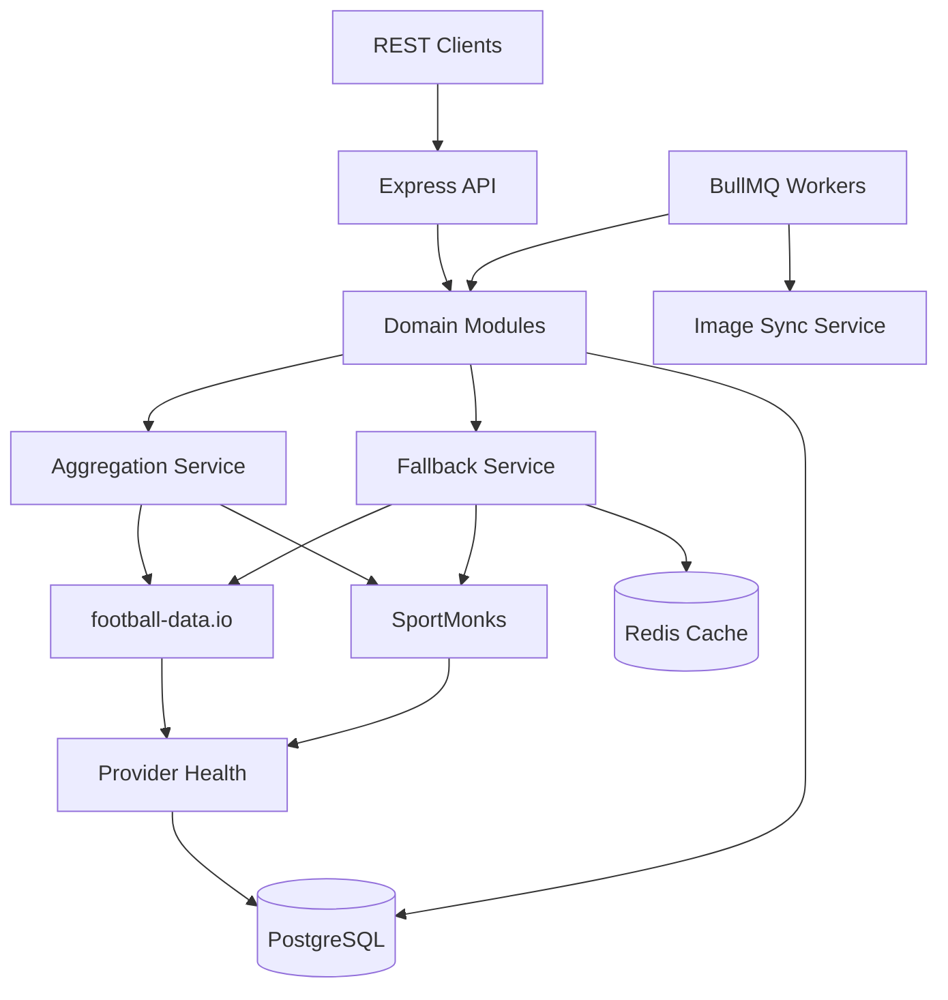

# Football Data Aggregator API

Production-grade Node.js backend that aggregates **[footballdata.io](https://footballdata.io/documentation/endpoints/)** and **SportMonks** into a single unified REST API with normalized schemas, Redis caching, PostgreSQL persistence, provider fallback, and BullMQ background sync.

## Architecture Overview



### Layers

| Layer | Responsibility |
|-------|----------------|
| **Routes / Controllers** | HTTP, validation (Zod), standardized responses |
| **Modules** | Teams, fixtures, standings, provider health |
| **Services** | Aggregation, fallback, cache, provider health, image sync |
| **Providers** | `FootballProvider` interface — swappable adapters |
| **Normalizers** | Provider DTOs → unified schemas |
| **Persistence** | Prisma ORM, provider mappings, sync logs |
| **Workers** | Scheduled sync + image downloads via BullMQ |

### Folder Structure

```
src/
├── config/           # Environment & Redis
├── modules/          # teams, fixtures, standings, providers
├── providers/        # football-data, sportmonks adapters
├── normalizers/      # Unified schema transformers
├── services/         # aggregation, fallback, cache, health, images
├── workers/          # BullMQ job processors
├── queues/           # Queue definitions & cron schedules
├── db/               # Prisma client & persistence
├── utils/            # logger, HTTP client, merge helpers
├── middlewares/      # validation, error handling
├── routes/           # API router
├── app.ts
└── index.ts
```

## Provider Comparison

| Capability | footballdata.io | SportMonks |
|------------|------------------|------------|
| Teams | Yes | Yes |
| Fixtures | Yes | Yes |
| Standings | Yes (primary) | Yes |
| Team logos | Yes (crest URLs) | Yes (image_path) |
| Player images | No | Yes |
| League logos | Yes (emblem) | Yes |
| Stadium images | Limited | Yes (venue images) |
| Live scores | No | Yes |
| Historical data | Yes | Yes |

**Phase 1 strategy:** [footballdata.io](https://footballdata.io/api/v1) (`Authorization: Bearer`) is prioritized for standings and fixtures via `/leagues/{league_id}/*`; SportMonks v3 (`https://api.sportmonks.com/v3/football`) enriches logos, venue images, and participant metadata. The aggregation layer merges both by team name matching and prefers richer fields.

See [docs/provider-capabilities.md](docs/provider-capabilities.md) for the full matrix.

## Fallback Strategy

1. Try providers in `PROVIDER_PRIORITY` order (default: `footballData,sportmonks`).
2. On failure, record health metrics and try the next provider.
3. If all providers fail, serve **stale Redis cache** (teams/fixtures/standings TTLs configurable).
4. If cache is empty, return `503` with `PROVIDER_UNAVAILABLE`.

## Normalization Strategy

Each provider adapter returns **unified types** (`UnifiedTeam`, `UnifiedFixture`, `UnifiedStanding`) via dedicated normalizers. Unified IDs are deterministic:

- football-data team: `fd-{providerId}`
- SportMonks team: `sm-{providerId}`

Cross-provider merge uses name/shortName matching; `providerIds` maps retain both external IDs for `provider_mappings`.

## Caching Strategy

| Entity | Default TTL | Redis key pattern |
|--------|-------------|-------------------|
| Teams | 3600s | `football:teams:all` |
| Fixtures | 300s | `football:fixtures:all` |
| Standings | 600s | `football:standings:all` |

Cache is written after successful provider fetch. Fallback reads cache when providers are down.

## Setup

### Prerequisites

- Node.js 20+
- Docker & Docker Compose (recommended)
- API keys: [footballdata.io](https://footballdata.io/), [SportMonks](https://www.sportmonks.com/)

### Local Development

```bash
cp .env.example .env
# Edit .env with your API keys

npm install
npm run db:generate
docker compose up -d postgres redis
npm run db:push

npm run dev          # API on :3000
npm run worker       # Background workers (separate terminal)
```

### Docker (full stack)

```bash
cp .env.example .env
docker compose up --build
```

Services: `api` (port 3000), `worker`, `postgres`, `redis`.

## API Documentation

| Document | Description |
|----------|-------------|
| [docs/API.md](docs/API.md) | Full API reference |
| [docs/ENDPOINTS.md](docs/ENDPOINTS.md) | Quick endpoint table |
| [docs/openapi.yaml](docs/openapi.yaml) | OpenAPI 3.0 spec (Postman/Swagger import) |
| [docs/postman-collection.json](docs/postman-collection.json) | Postman collection |
| [docs/samples/](docs/samples/) | Example JSON responses |

## API Endpoints

| Method | Path | Description |
|--------|------|-------------|
| GET | `/health` | Liveness check |
| GET | `/api/v1/teams` | List teams (aggregated) |
| GET | `/api/v1/teams/:id` | Team by unified ID |
| GET | `/api/v1/fixtures` | List fixtures |
| GET | `/api/v1/standings` | League standings |
| GET | `/api/v1/providers/health` | Provider health + capabilities |

### Query Parameters

- **Teams / Standings / Fixtures:** `leagueId` (footballdata.io public league_id), `seasonId` (optional), `dateFrom`, `dateTo` (fixtures)
- **SportMonks:** uses `DEFAULT_LEAGUE_ID` when `leagueId` is omitted

### Examples

```bash
# Teams (Premier League — league_id 10 in footballdata.io docs)
curl "http://localhost:3000/api/v1/teams?leagueId=10"

# Single team
curl "http://localhost:3000/api/v1/teams/fd-57"

# Fixtures
curl "http://localhost:3000/api/v1/fixtures?leagueId=10"

# Standings
curl "http://localhost:3000/api/v1/standings?leagueId=10"

# Provider health
curl "http://localhost:3000/api/v1/providers/health"
```

Sample responses: [docs/samples/](docs/samples/).

### Response Format

**Success:**

```json
{
  "success": true,
  "data": [],
  "meta": { "source": "provider", "cached": false, "providers": ["footballData"] }
}
```

**Error:**

```json
{
  "success": false,
  "error": { "message": "Provider unavailable", "code": "PROVIDER_UNAVAILABLE" }
}
```

## Background Jobs

| Queue | Jobs | Default schedule |
|-------|------|------------------|
| `football-sync` | sync-teams, sync-fixtures, sync-standings | cron via `.env` |
| `football-images` | sync-team-images | daily 03:00 |

Workers persist normalized data to PostgreSQL and log outcomes in `sync_logs`.

## Database

Prisma models: `teams`, `fixtures`, `standings`, `leagues`, `provider_mappings`, `sync_logs`, `provider_health`, `image_resources`.

```bash
npm run db:migrate   # create migration
npm run db:studio    # Prisma Studio
```

## Future Roadmap

- [ ] Additional providers (API-Football, Opta)
- [ ] Player endpoints with headshot sync
- [ ] GraphQL gateway
- [ ] WebSocket live score stream
- [ ] Betting odds module (out of scope for phase 1)
- [ ] Kubernetes Helm chart
- [ ] OpenAPI / Swagger documentation
- [ ] Rate limiting & API keys for consumers

## License

MIT
